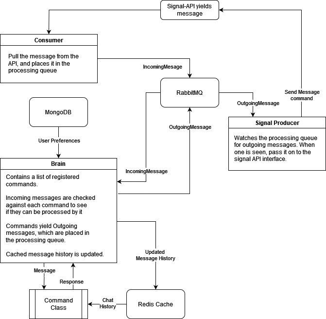

# The Razzler

This is my attempt at a signal bot, with a chat GPT backend. The aim is to have the robot act as human-like as possible, so it can slot itself into a group chat and take part in conversations.

The bot is made up of a few components. A [signal API]() recieves messages from the signal service. Consumers process these and place them on the processing queue, in RabbitMQ. From there, the "Brain" picks them up, and checks them agains its list of registered commands. Commands may yield a response (or several), which are placed back on the processing queue. From the queue, outgoing messages are picked up by a Producer, which sends the message back to the signal API. This may be easier to understand graphically:

<div style="text-align: center;">
  
</div>


Commands are currently undocumented. Sorry!


# TODO

- Implement profiling for members of a chat
- The web interface could have a list of razzler image descriptions, from group chats that people are part of. It might be interesting to see what the razzler sees in various images
- The web interface needs some example conversation, so people can test their prompts in a private environment.
- Use a proper file lock system


# Developer setup

I use a dev container to keep things easy and consistent.

1. Install VS Code
2. Install the Dev Container extension
3. Download and extract the Razzler Data folder: [here](https://nextcloud.wildjames.com/s/qcGffbm2Ygj28bs) (talk to me for the required password)
4. Press `CTRL+SHIFT+P` on windows, or `CMD+SHIFT+P` on a mac to bring up the command prompt
5. Type "Dev Containers: Open Folder in Container" and choose the base directory of the repo
6. Wait for the dev container to start up

Note that if you're on windows, the user configuration API will not be available on the host windows machine (or any other machine, for that matter) until the port has been [forwarded from WSL to windows](https://superuser.com/questions/1717753/how-to-connect-to-windows-subsystem-for-linux-from-another-machine-within-networ/1830244#1830244).

You will need two files in the root of the repo:

## `.env`

```
OPENAI_API_KEY=<KEY>
DATA_DIR=<Where is data located>
```

These will be used to run the code.

## Makefile commands

- `install`: Install the requirements for local development in a new `venv` space
- `dev`: Start a "live" version of the razzler stack, which should load changes as they're made
- `build`: Build the official docker image
- `run`: Run the latest version of the docker image
- `brun`: Build and run the docker image
- `publish`: Build the docker image with the `latest` tag, and push to docker hub
- `clean`: Reset the build environment
